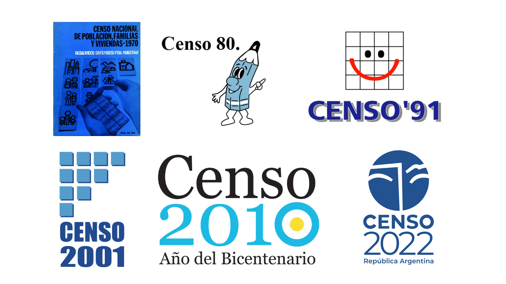
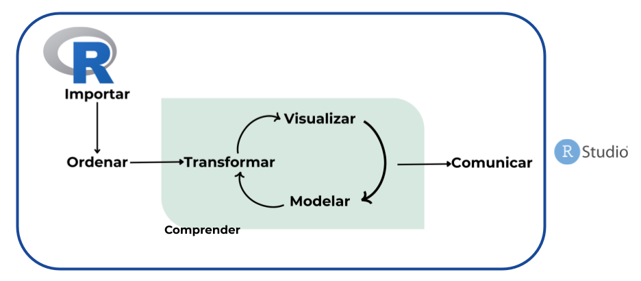
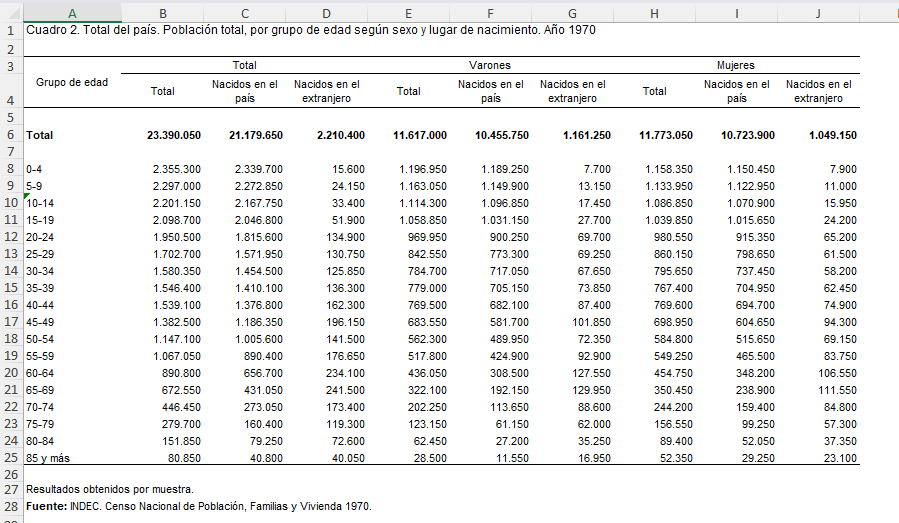
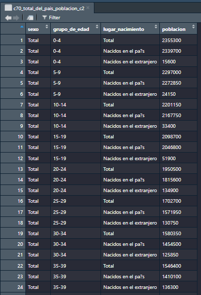
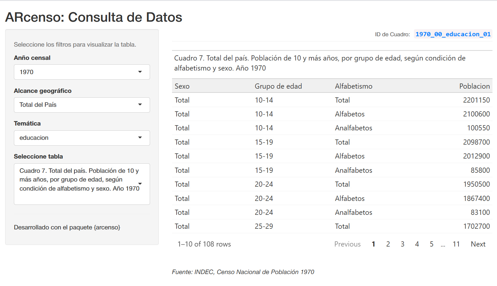

# Datos censales 

## 

> “El censo de población es la operación que consiste en recopilar, elaborar, evaluar, analizar y difundir, de manera simultánea, datos demográficos, económicos y sociales de todas las personas de un país o de una parte bien delimitada de un país, en un momento determinado.”[^1] 


[^1]: [Principios y recomendaciones para los censos de población y habitación - ONU](https://unstats.un.org/unsd/publication/seriesm/seriesm_67rev2s.pdf)


## Características esenciales que debe cumplir un censo:

- **Universalidad:** cubrir a toda la población y/o todas las viviendas.

- **Simultaneidad:** referirse a la misma fecha de referencia.

- **Periodicidad:** realizarse en intervalos regulares, generalmente cada 10 años.

- **Individualidad:** registrar datos de cada persona y cada vivienda de manera separada.


## Los censos de población del INDEC

> Toda la data de los censos en Argentina está en [censo.gob.ar](https://censo.gob.ar/index.php/historia/)

{width="80%" fig-align="center"}


## `Importancia de los datos censales`

::: {.incremental}

- Es una herramienta clave para entender las caracteristicas y necesidades de la población.

- Proporcionan datos esenciales para la planificación y el desarrollo de las políticas públicas.

- Planificación social y económica

- Investigación académica y estudios sociales

- Investigaciones de mercado y mucho más...
:::

## `R`

::: {.incremental}

- `R` es una herramienta orientada al trabajo estadístico y análisis de datos.

- Es un software libre y de código abierto, lo que facilita la colaboración y reproducibilidad.

- Existen otros paquetes de datos censales desarrollados en `R` (por ejemplo, `censobr` para Brasil), lo que crea un ecosistema que favorece la interoperabilidad y el aprendizaje compartido.

::: 


## Proceso de trabajo en ciencia de datos con `R`

  {width=80% fig-align="center"}

## **`ARcenso`** {.smaller}


Es una iniciativa ciudadana que nació de nuestra experiencia profesional con datos censales en el INDEC, motivada por la necesidad de contar con datos accesibles y ordenados, e inspirada en el espíritu colaborativo de la comunidad R. Con el apoyo del Programa de Campeonas de rOpenSci (2023–2024), el proyecto es liderado por Andrea Gómez Vargas, junto a Emanuel Ciardullo como co-desarrollador y Luis D. Verde como mentor.


{width="25%" fig-align="center"} 


## ¿Cuál es la `propuesta`?

<br>

**Generar un paquete que permita disponer de los datos oficiales de los censos nacionales de población en Argentina** provenientes del INDEC desde 1970 hasta 2022, homogeneizados, ordenados y listos para usar.

## Objetivo

> Disponibilidad: de excel a **tablas ordenadas** en R

::::: columns
::: {.column width="70%"}
{width="110%"}
:::

::: {.column width="30%"}
{width="100%"}
:::
:::::

# ¿Por qué?


## `Análisis históricos y memoria digital`

<br>

Actualmente los resultados históricos censales de **1970, 1980, 1991, 2001, 2010 y 2022** están disponibles en distintos formatos a través de libros físicos, PDFs, archivos en formato excel o en REDATAM, sin contar con un sistema o formato unificado que permita trabajar con los datos de estos seis periodos censales como base de datos.


# Antes de las funciones: `Marco conceptual`


## Principios `FAIR` {.smaller}

**Localizable (`Findable`):**

Datos censales centralizados que abarcan seis periodos censales nacionales (1970–2022)

**Accesible (`Accessible`):**

Conjuntos de datos censales públicos, homogenizados, disponibles en formatos abiertos y acompañados de documentación y metadatos completos.

**Interoperable (`Interoperable`):**

Tablas ordenadas (formato tidy) y bien estructuradas que permiten una integración sencilla con otros conjuntos de datos.

**Reutilizable (`Reusable`):**

Incluye descripciones detalladas de variables, codificación estandarizada, licencias abiertas y estructuras de datos reproducibles que facilitan su uso a largo plazo y la comparación entre estudios.


## Estructura y temas de los datos censales según la `ONU` {.smaller}

<br>

::: {.columns}

::: {.column width="5%"}
:::

::: {.column width="30%"}

`Temas del Censo`
**Núcleo:** Variables esenciales
(ej.: edad, sexo, población)

**Núcleo derivado:** Variables calculadas
(ej.: tasas de fecundidad)

**Adicionales:** Temas específicos del país
(ej.: religión)
:::

::: {.column width="5%"}
:::

::: {.column width="30%"}

`Unidades Conceptuales`
**Población:** Personas individuales

**Vivienda:** Unidades habitacionales físicas

**Hogar:** Personas que comparten una vivienda
:::

::: {.column width="30%"}

`Cobertura Geográfica`

**Nacional**: Total del país

**Jurisdicciones**: (23 provincias de Argentina y la Ciudad Autónoma de Buenos Aires)
:::

:::


# `ARcenso` :package:


## ¿Cómo usarlo?

<br>

### Instalación

```{r  eval=FALSE}
# install.packages("remotes")
remotes::install_github("SoyAndrea/arcenso")
```

<br> <br>

### Activación del paquete

```{r}
library(arcenso)
```

# Principales funciones


## `geo_metadata`

> Codigos geograficos estándar de INDEC 

<br>

```{r}
geo_metadata
```

## `check_repository()`

> Chequeo de tablas dispónibles por año o temática censal

<br>

```{r}
check_repository(year = 1970,
                 geo_code = "00")
```
## `arcenso_app()`

> tablero de consulta

```{r eval=FALSE}
arcenso_app()
```

{width="120%" fig-align="center"}


## `get_census()`


> Obtener tablas por año o temática censal

<br>

```{r}
get_census(year = 1970,
           topic = "estructura",
           geo_code = "00")
```


## Documentación


```{r echo=FALSE}
knitr::include_url("https://soyandrea.github.io/arcenso/",height = 600)
```


## Manos al código

> [Carpeta para descargar scripts de trabajo](https://drive.google.com/drive/folders/1IgGfcNBAMZzf2p83MxH9YJtzyocBx0Pe?usp=sharing)


## Instalación de paquetes de trabajo

<br>

### `ARcenso`

```{r}
#| echo: true
#| eval: false
install.packages("remotes")
remotes::install_github("SoyAndrea/arcenso")
```

<br>

### `tidyverse`

```{r}
#| echo: true
#| eval: false
#| 
install.packages("tidyverse")
install.packages("gt")
```

## Activación de paquetes con `library`

<br>

> esto realizo cada vez que use R 

<br>

```{r}
#| eval: true
#| echo: true
#| message: false
#| warning: false

library(arcenso)  # obtención de datos censales
library(dplyr)    # procesamiento de datos
library(tidyr)    # orden y transformación de datos
library(ggplot2)  # diseño de gráficos
library(gt)       # diseño de tablas
```

## Preparación de los datos

```{r}
poblacion_1970 <- get_census(id = "1970_00_estructura_01")

pob_1970 <- poblacion_1970 |>
  filter(sexo != "Total") |>
  mutate(
    censo = 1970,
    grupo_de_edad = case_when(
      grupo_de_edad == "0-4" ~ "00-04",
      grupo_de_edad == "5-9" ~ "05-09",
      TRUE ~ grupo_de_edad
    )
  ) |>
  rename(grupo_edad = grupo_de_edad) |>
  select(censo, sexo, grupo_edad, poblacion)
```

### Censo 1980

```{r}
poblacion_1980 <- get_census(id = "1980_00_estructura_03")

pob_1980 <- poblacion_1980 |>
  filter(
    urbano_rural == "Total",
    sexo != "Total",
    edad != "Total"
  ) |>
  mutate(
    censo = 1980,
    edad_num = ifelse(edad == "85 y más", 85, as.numeric(edad)),
    grupo_edad = case_when(
      edad_num %in% c(0:4)   ~ "00-04",
      edad_num %in% c(5:9)   ~ "05-09",
      edad_num %in% c(10:14) ~ "10-14",
      edad_num %in% c(15:19) ~ "15-19",
      edad_num %in% c(20:24) ~ "20-24",
      edad_num %in% c(25:29) ~ "25-29",
      edad_num %in% c(30:34) ~ "30-34",
      edad_num %in% c(35:39) ~ "35-39",
      edad_num %in% c(40:44) ~ "40-44",
      edad_num %in% c(45:49) ~ "45-49",
      edad_num %in% c(50:54) ~ "50-54",
      edad_num %in% c(55:59) ~ "55-59",
      edad_num %in% c(60:64) ~ "60-64",
      edad_num %in% c(65:69) ~ "65-69",
      edad_num %in% c(70:74) ~ "70-74",
      edad_num %in% c(75:79) ~ "75-79",
      edad_num %in% c(80:84) ~ "80-84",
      TRUE ~ "85 y más"
    )
  ) |>
  select(-edad, -urbano_rural, -edad_num) |>
  select(censo, sexo, grupo_edad, poblacion)
```

```
poblacion <- bind_rows(pob_1970, pob_1980) |>
  mutate(
    poblacion = as.numeric(poblacion),
    sexo = factor(sexo, levels = c("Varones", "Mujeres")),
    grupo_edad = factor(
      grupo_edad,
      levels = c(
        "00-04", "05-09", "10-14", "15-19", "20-24",
        "25-29", "30-34", "35-39", "40-44", "45-49",
        "50-54", "55-59", "60-64", "65-69", "70-74",
        "75-79", "80-84", "85 y más"))
  )
```

## Estructura de la población


```{r}
head(poblacion)
```


### Pirámide poblacional

```
piramide <- poblacion |>
  group_by(censo, sexo) |>
  mutate(
    poblacion_rel = if_else(
      sexo == "Varones",
      -poblacion / sum(poblacion),
       poblacion / sum(poblacion))) |>
  ungroup()
```

```{r}
# Pirámide comparativa
piramide |>
  ggplot(aes(x = poblacion_rel, y = grupo_edad, fill = sexo)) +
  geom_col() +
  facet_wrap(~ censo, ncol = 2) +
  scale_fill_manual(values = c("#00f59b", "#7014f2")) +
  scale_x_continuous(
    labels = function(x) paste0(abs(round(x * 100, 1)), "%"),
    limits = c(-0.15, 0.15),
    breaks = seq(-0.15, 0.15, by = 0.05)) +
  labs(
    title    = "Estructura de la población por sexo y grupo quinquenal de edad",
    subtitle = "Argentina. Años 1970 y 1980",
    x        = "Porcentaje",
    y        = "Grupo quinquenal de edad",
    caption  = "Fuente: INDEC, Censo Nacional de Población 1970 y 1980. Procesado con ARcenso.",
    fill     = "Sexo") +
  theme_bw() +
  theme(
    legend.position = "bottom",
    strip.text = element_text(face = "bold", size = 12) )
```


### Índice de envejecimiento

```{r}
envejecimiento <- poblacion |>
  group_by(censo) |>
  summarise(
    poblacion_0a14   = sum(poblacion[grupo_edad %in% c("00-04", "05-09", "10-14")]),
    poblacion_65ymas = sum(poblacion[grupo_edad %in% c("65-69", "70-74", "75-79", "80-84", "85 y más")]),
    indice = round(poblacion_65ymas / poblacion_0a14 * 100, 0))

gt(envejecimiento) |>
  tab_header(
    title    = "Comparación del índice de envejecimiento",
    subtitle = "Argentina. Años 1970 y 1980"
  ) |>
  tab_spanner(
    label   = "Población",
    columns = c(poblacion_0a14, poblacion_65ymas)
  ) |>
  fmt_number(
    columns  = c(poblacion_0a14, poblacion_65ymas),
    decimals = 0,
    sep_mark = ".",
    dec_mark = ","
  ) |>
  cols_label(
    poblacion_0a14   = "0 a 14 años",
    poblacion_65ymas = "65 años y más",
    indice           = "Índice"
  ) |>
  tab_source_note(
    source_note = 
      md("**Fuente:** elaboración propia en base a datos de INDEC (Censos Nacionales de Población 1970 y 1980).")) |>
  tab_options(
    table.background.color = "white"
  )
```

### Índice de feminidad

```
feminidad <- poblacion |>
  filter(
    grupo_edad %in% c("60-64", "65-69", "70-74", "75-79", "80-84", "85 y más")
  ) |>
  group_by(censo, grupo_edad, sexo) |>
  summarise(poblacion = sum(poblacion), .groups = "drop") |>
  pivot_wider(names_from = sexo, values_from = poblacion) |>
  mutate(
    indice_feminidad = round(Mujeres / Varones * 100, 0)
  ) |>
  select(-Varones, -Mujeres)
```
```
feminidad |>
  pivot_wider(
    names_from   = censo,
    values_from  = indice_feminidad,
    names_prefix = "censo_"
  ) |>
  ggplot(aes(y = grupo_edad)) +
  geom_segment(
    aes(x = censo_1970, xend = censo_1980, yend = grupo_edad),
    color = "grey85",
    linewidth = 1) +
  geom_point(aes(x = censo_1970), color = "#ff0f7b", size = 3) +
  geom_point(aes(x = censo_1980), color = "#f89b29", size = 3) +
  geom_text(aes(x = censo_1970, label = censo_1970), hjust = 1.4, size = 3) +
  geom_text(aes(x = censo_1980, label = censo_1980), hjust = -0.4, size = 3) +
  labs(
    x        = "Mujeres por cada 100 varones",
    y        = "Grupo de edad",
    title    = "Cambio en el índice de feminidad de la población de 60 años y más",
    subtitle = "Argentina. Años 1970 y 1980",
    caption  = "Fuente: INDEC, Censo Nacional de Población 1970 y 1980. Procesado con ARcenso."
  ) +
  theme_minimal()
```

### Índice de Whipple

```{r}
edad_simple_1980 <- get_census(id = "1980_00_estructura_03") |>
  filter(
    urbano_rural == "Total",
    sexo == "Total",
    edad != "Total",
    edad != "85 y más") |>
  mutate(
    edad = as.numeric(edad),
    poblacion = as.numeric(poblacion))

whipple <- edad_simple_1980 |>
  filter(edad >= 23, edad <= 62) |>
  summarise(
    pob_multiplos_5 = sum(poblacion[edad %in% seq(25, 60, by = 5)]),
    pob_total       = sum(poblacion),
    indice_whipple  = round(pob_multiplos_5 / (pob_total / 5) * 100, 1) )
```

```{r}
gt(whipple) |>
  tab_header(
    title    = "Índice de Whipple",
    subtitle = "Argentina. Censo 1980 (población de 23 a 62 años)") |>
  fmt_number(
    columns  = c(pob_multiplos_5, pob_total),
    decimals = 0,
    sep_mark = ".",
    dec_mark = ",") |>
  cols_label(
    pob_multiplos_5 = "Población en edades múltiplo de 5",
    pob_total       = "Población total (23 a 62 años)",
    indice_whipple  = "Índice") |>
  tab_source_note(
    source_note = 
      md("**Fuente:** elaboración propia en base a datos de INDEC (Censo Nacional de Población 1980). Escala de referencia: <105 muy preciso, 105–124 aceptable, ≥125 deficiente.")) |>
  tab_options(
    table.background.color = "white"
  )
```


# Preguntas


# Gracias :grin:
